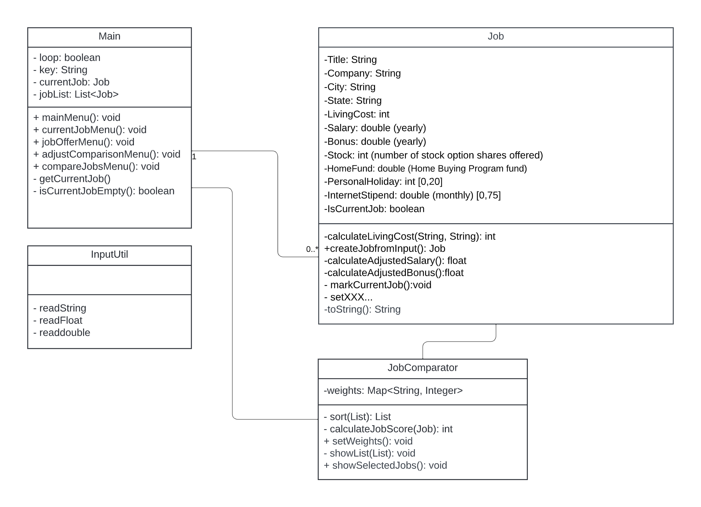
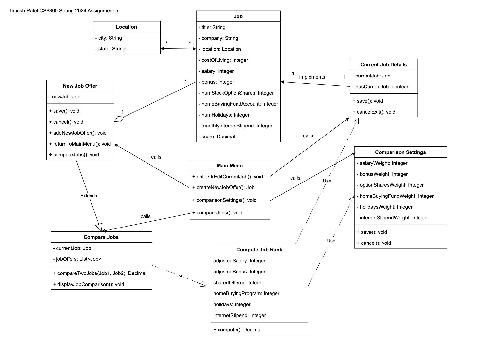
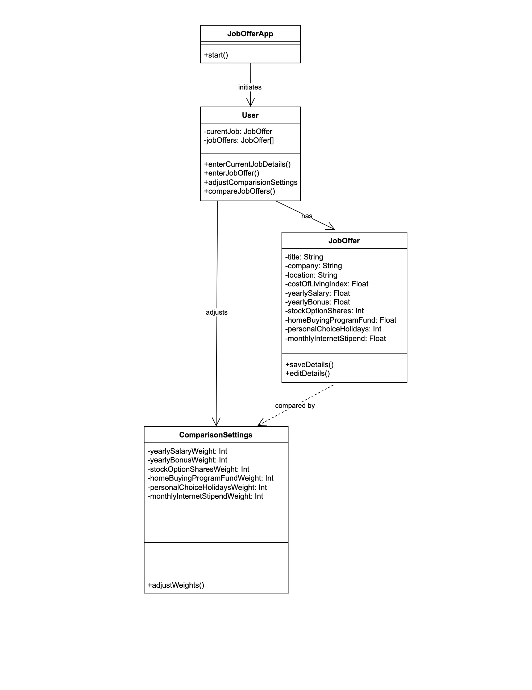
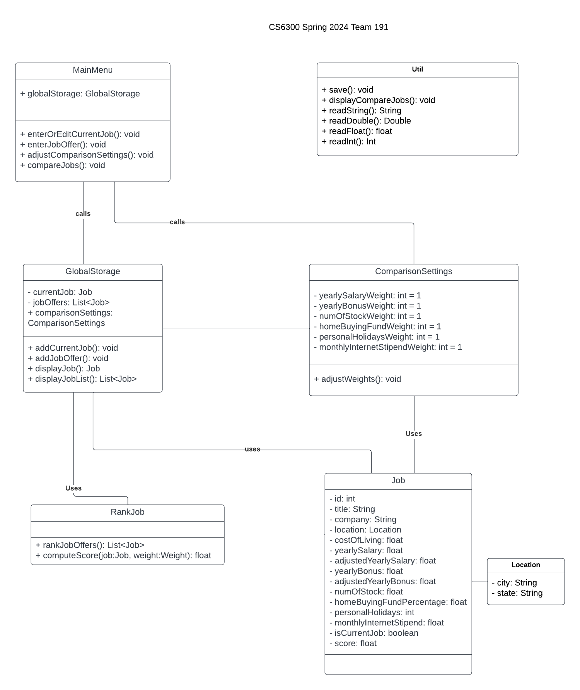

# design-discussion.md

## Design 1 - Haochen

### Pros
1. Job class has all the key fields.
2. Simple and easy to understand design.
3. Weight class is easy to understand.

### Cons
1. Class names need to be more accurate.
2. Need to implement more OOP. Need abstract classes and methods.

## Design 2 - Jing

### Pros
1. Lots of useful helper methods information like getCurrentJob().
2. InputUtil can be useful in the future for custom user inputs.
3. Design flow and cardinality is good.

### Cons
1. Missing weight class, it would be easy to understand and set weights.

## Design 3 - Timesh

### Pros
1. UML shows relationships between classes.
2. Low leveled and extensive. Can be modeled for final design.

### Cons
1. Unnecessary job offer and current job details class (can add just boolean).
2. Confusion on jobOffers. Need list storage in Compare Jobs.

## Design 4 - Vineet

### Pros
1. The flow of the UML design is good.
2. Simple and easy to understand design.

### Cons
1. Missing boolean to compare current job offer if it exists
2. Location class would be nice to have. Location(city,state).
3. User class should be renamed to Main Menu (causes confusion).

## Team design

There are quite a few commonalities between the final design and the individual designs such as everyone creating a Job object class and then having some sort of Main Menu.
Both designs also had implementations of the weight class and a job rank/compare class. Everyone did implement their UML diagrams with object oriented programming in mind.

There are a few important features we did add to our final design such as a GlobalStorage class which is where all jobs and job offers are stored. We also added a few extra classes like Location and a Util class that some group members had. The Util class contains methods that can be used throughout the application. We also improved the job ranking feature with a specific class and methods relating to calculating the job score. Overall we implemented a more abstract and object oriented approach that is easily readable and understandable.

## Summary

The discussion highlights the importance of striking a balance between simplicity and extensibility in the design process. It underscores the necessity of considering future scalability and flexibility when architecting systems, reminding us of the significance of careful planning and foresight. We gained insights into which functionality would be part of the frontend or backend components in the context of the UML class diagram. These lessons helped enhance our design and will also help us in the future deliverables.
