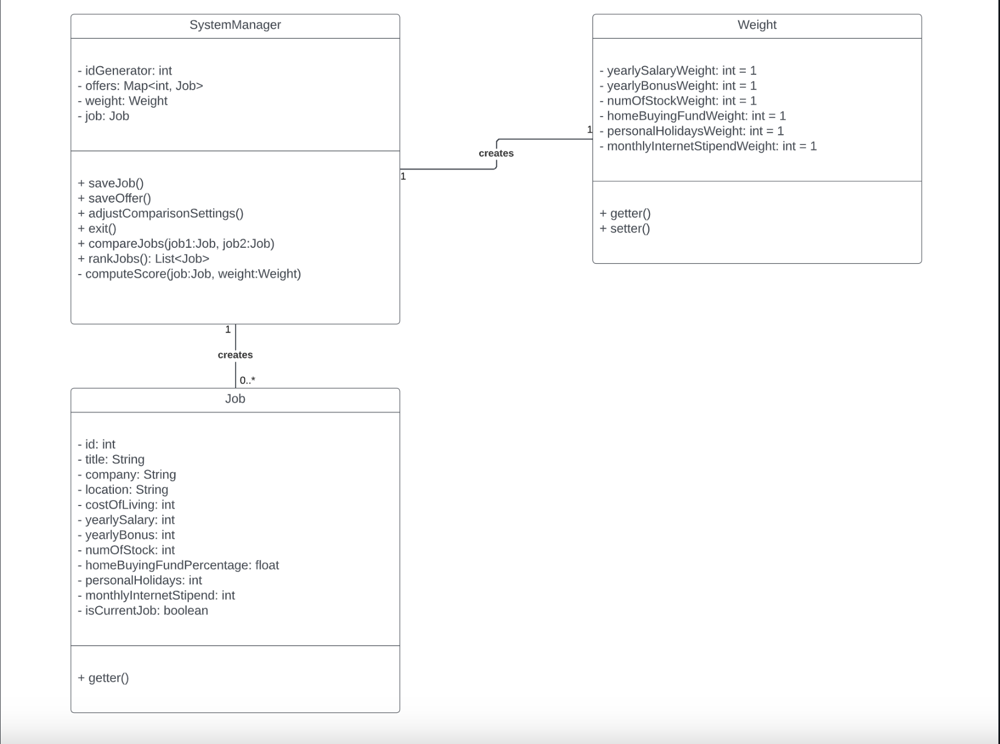

# design-discussion.md

## Design 1 - Haochen

### Pros
1. Job class has all the key fields.
2. Simple and easy to understand design.
3. Weight class is easy to understand.

### Cons
1. Class names need to be more accurate.
2. Need to implement more OOP. Need abstract classes and methods.

## Design 2 - Jing

### Pros
1. Lots of useful helper methods information like getCurrentJob().
2. InputUtil can be useful in the future for custom user inputs.
3. Design flow and cardinality is good.

### Cons
1. Missing weight class, it would be easy to understand and set weights.

## Design 3 - Timesh

### Pros
1. UML shows relationships between classes.
2. Low leveled and extensive. Can be modeled for final design.

### Cons
1. Unnecessary job offer and current job details class (can add just boolean).
2. Confusion on jobOffers. Need list storage in Compare Jobs.

## Design 4 - Vineet

### Pros
1. The flow of the UML design is good.
2. Simple and easy to understand design.

### Cons
1. Missing boolean to compare current job offer if it exists
2. Location class would be nice to have. Location(city,state).
3. User class should be renamed to Main Menu (causes confusion).

## Team design

## Summary
