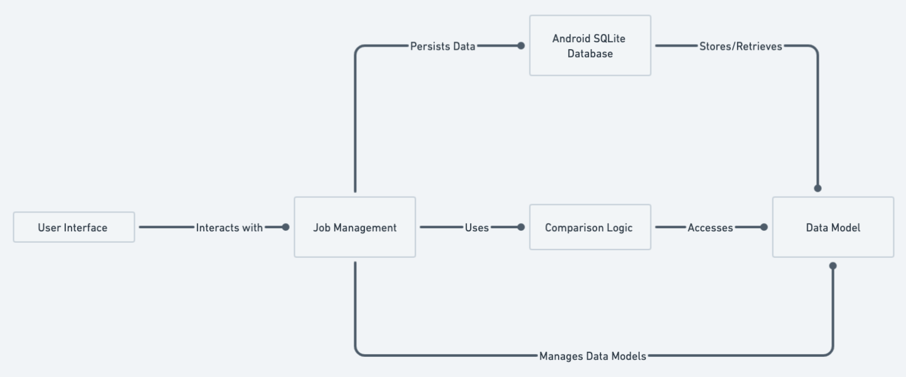
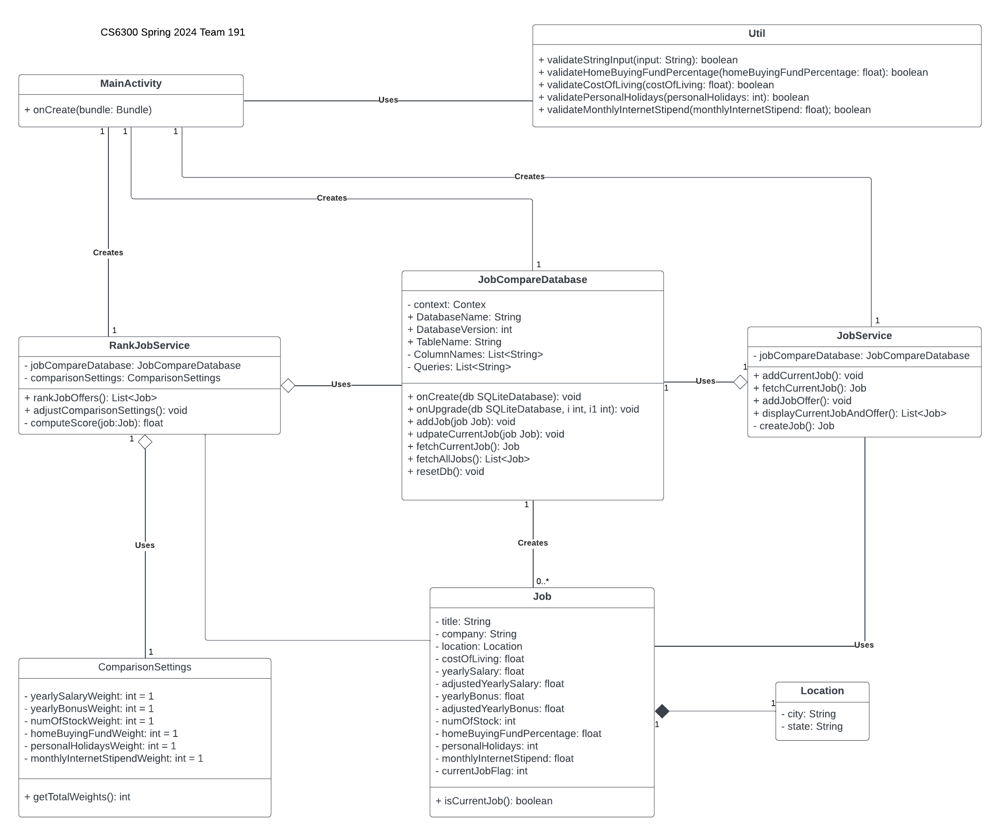
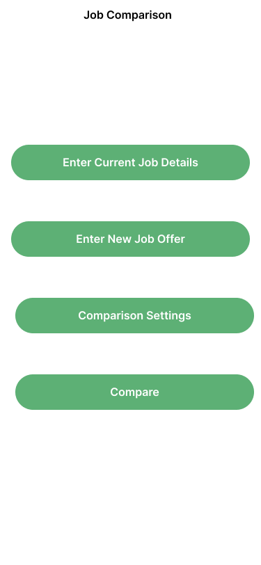
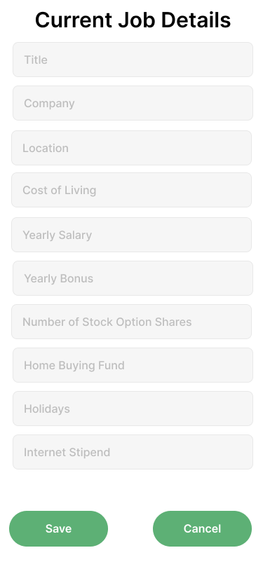
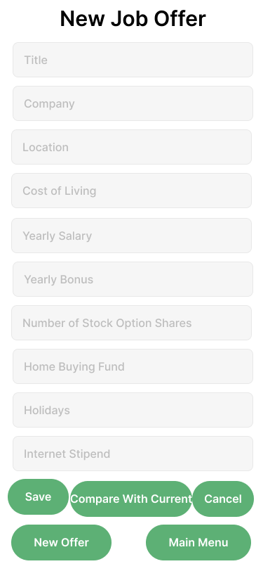
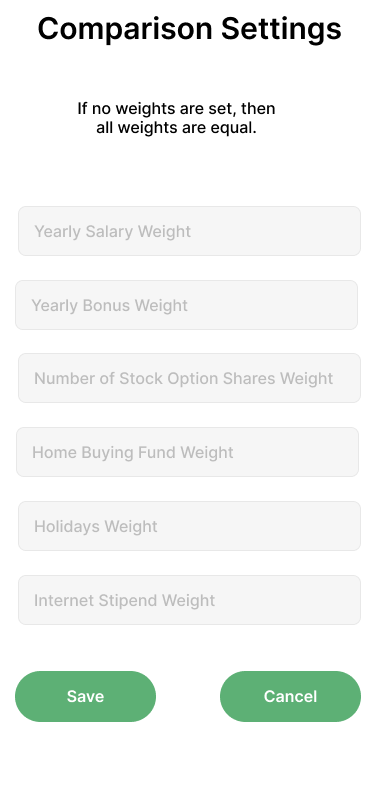
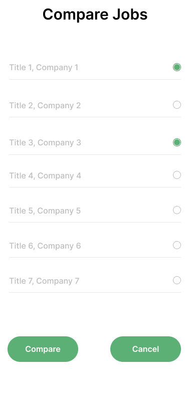
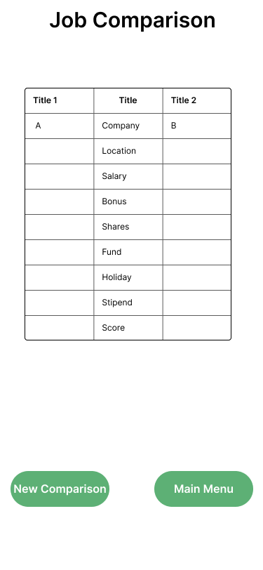

# Design Document

*This is the template for your design document. The parts in italics are concise explanations of what should go in the corresponding sections and should not appear in the final document.*

**Author**: Team 191 Timesh Patel (tpatel327) and Vineet Baburaj (vbaburaj6)

## 1 Design Considerations

*The subsections below describe the issues that need to be addressed or resolved prior to or while completing the design, as well as issues that may influence the design process.*

### 1.1 Assumptions

*Describe any assumption, background, or dependencies of the software, its use, the operational environment, or significant project issues.*

Assumptions that we have for the use of this application is that it will be a single user system or a single system. This means that all the data will be accessed by whoever access the application. We are assuming that there is no need for a login page where we can then differentiate the data between users. The background of the software is an android application that is built using Java. As of now, we are unsure as to what the dependencies of the software may be. The use of this application will be for users who want a simple and easy way to save their job offers and compare details of those offers to be able to choose the best job for themselves. The operational environment will be in the android operating system as this will be an android application only. Significant project issues that can happen are timelines and deadlines for the application. This involves having meetings with the rest of the team and discussing tasks for everyone. Other project issues would be lack of familiarity with android application building and potential over-engineering of a relatively simple system.

### 1.2 Constraints

*Describe any constraints on the system that have a significant impact on the design of the system.*

Constraints that have a impact on the design of the system will be how we implement the actual job comparison feature. Most of the features in the application like adding a current job, a new job offer, and adjusting comparison settings are relatively simple tasks. The comparison feature is the main feature of this application and figuring out how to create a system that revolves around the comparison feature will be important. We have already discussed a few different ways to implement this comparison class/feature and all the method it may contain. Determining where the actual comparison takes place in the system is important.

### 1.3 System Environment

*Describe the hardware and software that the system must operate in and interact with.*

The system will be built using Java 17, Android 13 SDK 33. The hardware for this application will be a Google Pixel 6 running on Android 13 (API 33).

## 2 Architectural Design

*The architecture provides the high-level design view of a system and provides a basis for more detailed design work. These subsections describe the top-level components of the system you are building and their relationships.*

### 2.1 Component Diagram

*This section should provide and describe a diagram that shows the various components and how they are connected. This diagram shows the logical/functional components of the system, where each component represents a cluster of related functionality. In the case of simple systems, where there is a single component, this diagram may be unnecessary; in these cases, simply state so and concisely state why.*

### 2.2 Deployment Diagram

*This section should describe how the different components will be deployed on actual hardware devices. Similar to the previous subsection, this diagram may be unnecessary for simple systems; in these cases, simply state so and concisely state why.*

## 3 Low-Level Design

*Describe the low-level design for each of the system components identified in the previous section. For each component, you should provide details in the following UML diagrams to show its internal structure.*

### 3.1 Class Diagram

*In the case of an OO design, the internal structure of a software component would typically be expressed as a UML class diagram that represents the static class structure for the component and their relationships.*

### 3.2 Other Diagrams

*<u>Optionally</u>, you can decide to describe some dynamic aspects of your system using one or more behavioral diagrams, such as sequence and state diagrams.*

## 4 User Interface Design
*For GUI-based systems, this section should provide the specific format/layout of the user interface of the system (e.g., in the form of graphical mockups).*

