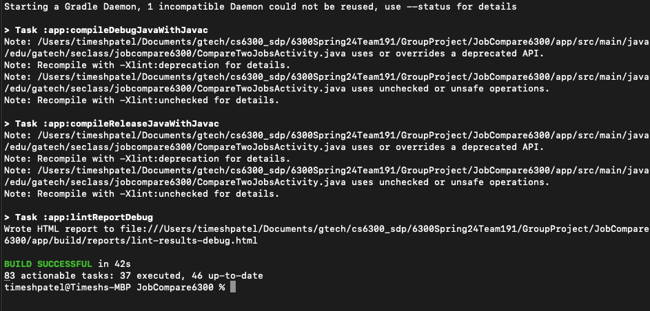
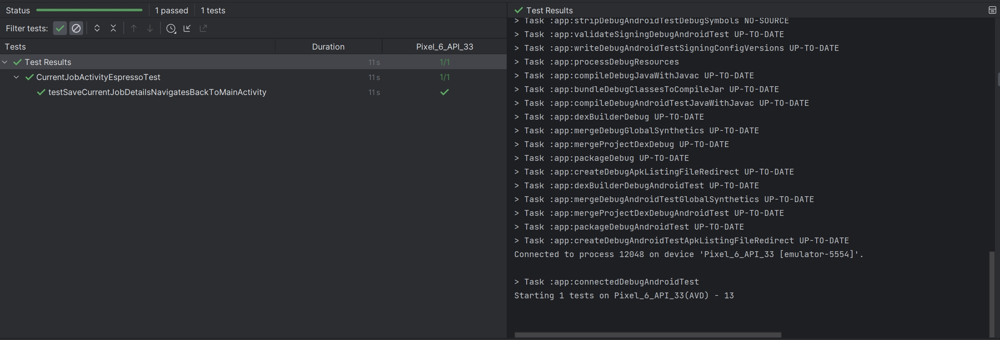
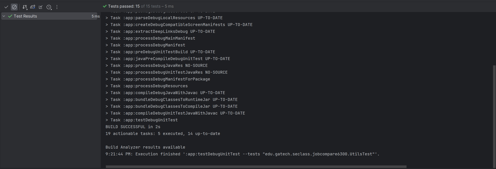
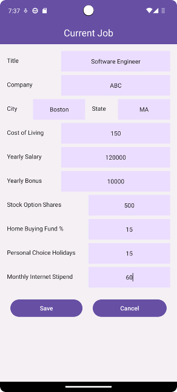
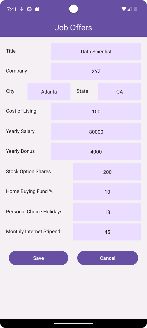
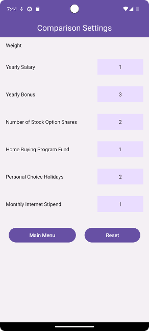
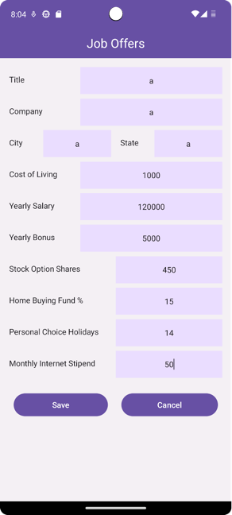
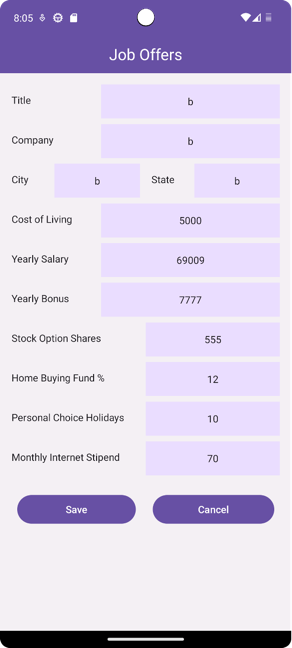
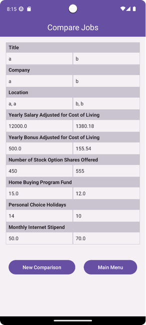

# Test Plan

**Author**: Vineet Baburaj

## 1 Build Results

## 2 Android Autotest Results

## 3 Unit Test Results

## End-to-End Test Case E2E1: Simulate job offer comparison process

### Test Description
Simulate the process of comparing job offers within the application, ensuring that the final comparison accurately reflects all entered data.

### Steps to Reproduce
1. Start the application.
    - 

2. Enter details for the current job.
    - 

3. Add multiple job offers.
   - 
    - 
    - 

4. Adjust comparison settings as needed.
    - 

5. Perform the comparison.
    - 

### Expected Results
- The final comparison screen displays all entered data, including details of the current job and the added job offers.

## End-to-End Test Case E2E2: Test flow without entering a current job

### Test Description
Test the application's flow when adding job offers and performing comparison without entering a current job.

### Steps to Reproduce
1. Start the application.
   - 

2. Add multiple job offers without entering a current job.
   - 
   - 
   - 

3. Adjust comparison settings as needed.
   - 

4. Perform the comparison without a current job.
   - 
   - 

### Expected Results
- The application handles comparisons of offers correctly even without a current job.

## End-to-End Test Case E2E3: Test editing and updating job details

### Test Description
Test the application to ensure that updates are correctly saved and reflected in the comparison.

### Steps to Reproduce
1. Start the application.
   - 

2. Enter and save details for the current job and a job offer.
   - 
   - 
   - 
   - 

3. Check updates are saved and reflected in the comparison.
   - 

### Expected Results
- Updates made to job details are correctly saved and reflected in the comparison.
