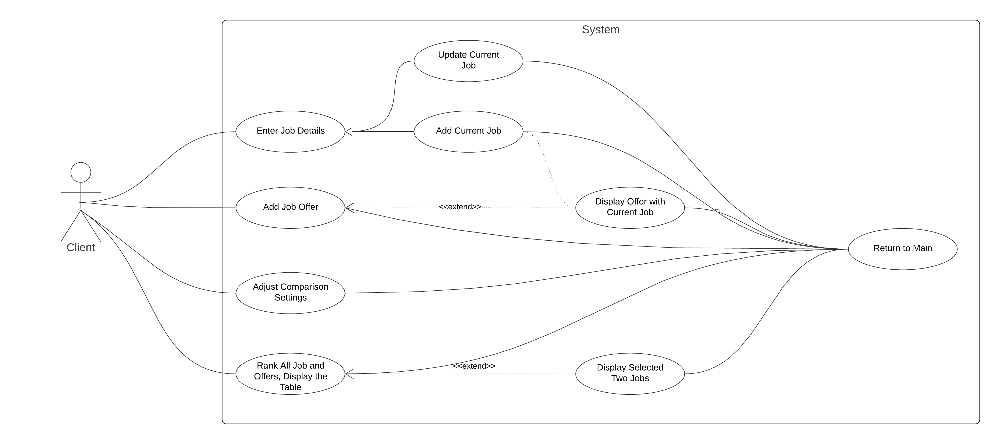

# Use Case Model

**Author**: Haochen Zhang

## 1 Use Case Diagram

## 2 Use Case Descriptions

- Add Current Job
    - Requirements: be shown a user interface to enter all the details of their current job.
    - Pre-conditions: user has never saved a current job before, and all fields shown must be properly filled: Title, Company, Location (entered as city and state), Cost of living in the location (expressed as an index), Yearly salary, Yearly bonus, Number of stock option shares offered, Home Buying Program fund (one-time dollar amount up to 15% of Yearly Salary), Personal Choice Holidays (A single overall number of days from 0 to 20), Monthly Internet Stipend ($0 to $75 inclusive).
    - Post-conditions: an Job object will be created and saved to GlobalStorage.currentJob with Job.isCurrentJob being set to true.
    - Scenarios:
        - Normal: users will see an alert to enter a current job, and users enter all the fields with valid values and the program proceeds.
        - Exception: users enter an invalid value, and will receive alert regarding the correct format of the input.

- Edit Current Job
    - Requirements: be shown a user interface that contains all the information of their current job, and they are able to edit all the details of their current job and save the new one.
    - Pre-conditions: user has saved his current job before
    - Post-condition: the original Job object in GlobalStorage.currentJob will be updated.
    - Scenarios:
        - Normal: users will see an alert that indicating they are editing the current job, and users enter all the fields with valid values and the program proceeds.
        - Exception: users enter an invalid value, and will receive alert regarding the correct format of the input.

- Add Job Offer
    - Requirements: be shown a user interface to edit all the details of their job offer.
    - Pre-conditions: all fields shown must be properly filled: Title, Company, Location (entered as city and state), Cost of living in the location (expressed as an index), Yearly salary, Yearly bonus, Number of stock option shares offered, Home Buying Program fund (one-time dollar amount up to 15% of Yearly Salary), Personal Choice Holidays (A single overall number of days from 0 to 20), Monthly Internet Stipend ($0 to $75 inclusive).
    - Post-condition: an Job object will be created and save to GlobalStorage.jobOffers with Job.isCurrentJob being set to false.
    - Scenarios:
        - Normal: users enter all the fields with valid values and the program proceeds.
        - Exception: users enter an invalid value, and will receive alert regarding the correct format of the input.

- Display Offer with Current Job
    - Requirements: be shown a user interface to compare all the details of their recently saved job offer with their current job.
    - Pre-conditions: the offer user is editing currently has been saved, and their current job has been save, too.
    - Post-condition: show a table displaying the two jobs, for each job: Title, Company, Location, Yearly salary adjusted for cost of living, Yearly bonus adjusted for cost of living, Number of Stock Option Shares Offered, Home Buying Program fund, Personal Choice Holidays, Monthly Internet Stipend
    - Scenarios:
        - Normal: user has saved the current editting job offer, and has saved current job, the program proceeds.
        - Exception1: user has not saved the current editting offer, will receive alert to save the offer before proceeding.
        - Exception2: user has not saved the current job, will receive alter to enter a current job before proceeding.

- Adjust Comparison Settings
    - Requirements: be shown a user interface to enter all the details of job comparison settings
    - Pre-conditions: no.
    - Post-condition: if no weights are assigned, all factors are considered equal
    - Scenarios:
        - Normal: users enter all the fields with valid values and the program proceeds.
        - Alternative: users have not entered weights, all fields will be assigned with 1.

- Rank All Job and Offers
    - Requirements: be shown a list of job offers, displayed as Title and Company, ranked from best to worst, and including the current job (if present), clearly indicated.
    - Pre-conditions: at least one job offer or current job has been saved.
    - Post-condition: only title and company will be displayed, and the list will be sorted based on the formula AYS + AYB + (CSO/3) + HBP + (PCH * AYS / 260) + (MIS*12), where: 
    AYS = yearly salary adjusted for cost of living,
    AYB = yearly bonus adjusted for cost of living,
    CSO = Company shares offered (assuming a 3-year vesting schedule and a price-per-share of $1),
    HBP = Home Buying Program,
    PCH = Personal Choice Holidays, 
    MIS= Monthly Internet Stipend.
    - Scenarios:
        - Normal: user has saved at least one job offer, the program proceeds.
        - Exception1: user has not saved any offer or current job, will receive alert to save at least one offer before proceeding.

- Display Selected Two Jobs
    - Requirements: be shown a user interface to select two jobs listed in "Rank All Job and Offers", and be shown a table comparing the two jobs
    - Pre-conditions: at least two offers or current job are saved in system.
    - Post-condition: show a table comparing the two jobs, displaying, for each job Title, Company, Location, Yearly salary adjusted for cost of living, Yearly bonus adjusted for cost of living, Number of Stock Option Shares Offered, Home Buying Program fund, Personal Choice Holidays, Monthly Internet Stipend
    - Scenarios:
        - Normal: user has saved at least two job offers or one offer one current job, the program proceeds.
        - Exception: the number of offers user selected less than two, will receive alter to select two offers before proceeding.

- Return to Main
    - Requirements: return to main page
    - Pre-conditions: no.
    - Post-condition: return to main page and all the in progress editting will be discarded
    - Scenarios:
        - Normal: user returns to main page.